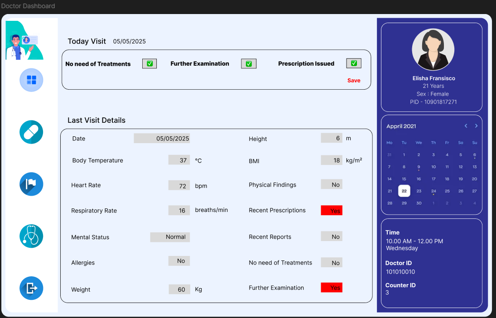
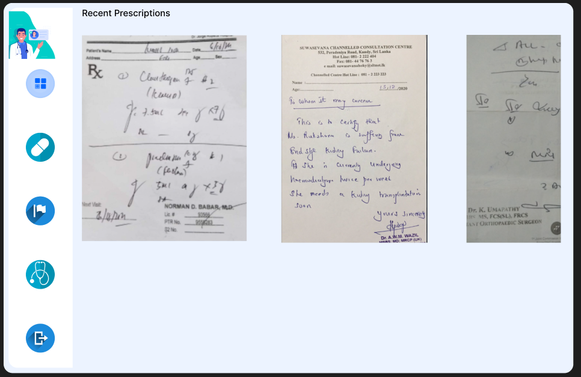
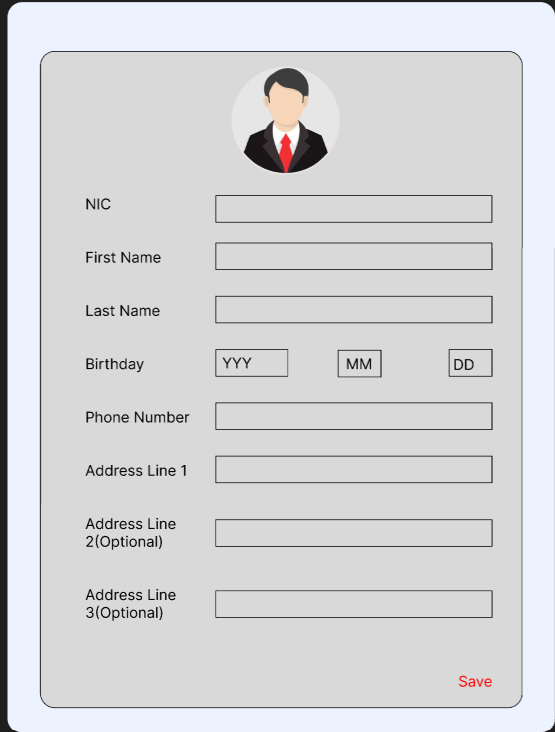
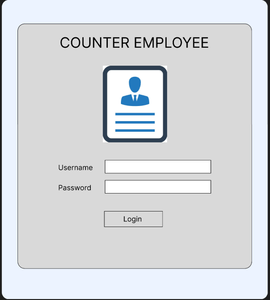
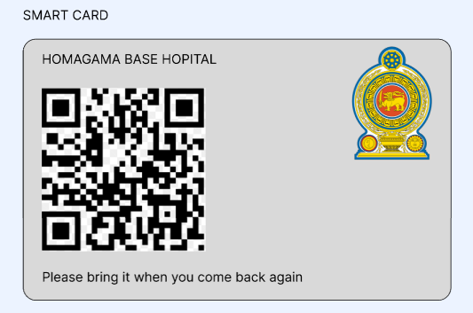
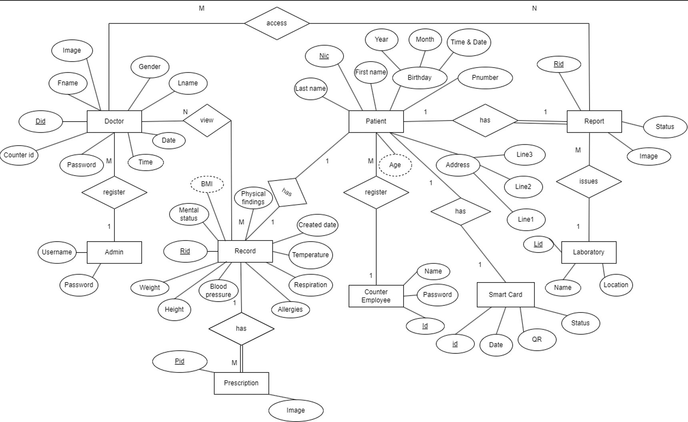
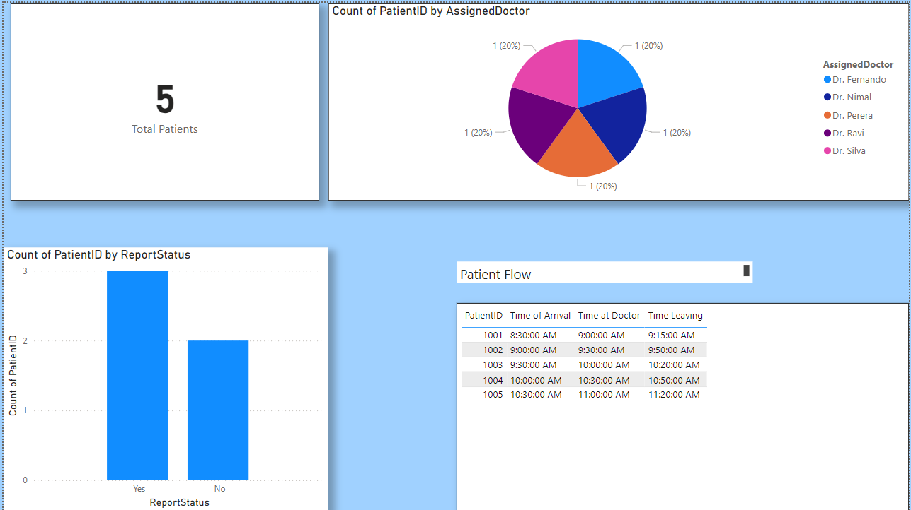

# 🏥 Smart OPD Receipt System (BPMN 2.0)

A system prototype and process redesign solution for improving the **Outpatient Department (OPD) Receipt Issuing Process** at **Homagama Base Hospital**, Sri Lanka.

> 📚 Coursework for **PUSL2052 – Business Process & ERP**  
> 🗓️ Academic Year: 2024–2025  
> 🎓 NSBM Green University  
> 👩‍🏫 Module Leader: Lakni Peiris (lakni.p@nsbm.ac.lk)

---

## 📌 Project Overview

This project addresses inefficiencies in the OPD patient registration and receipt-issuing process by designing a new **to-be process** and a supporting **system prototype**. We replaced manual and redundant tasks with an efficient **Smart Card & Token system**, optimized queue flow, and introduced digital support for medical staff.

---

## 📊 Table of Contents

- [Project Purpose](#project-purpose)
- [Organization](#organization)
- [As-Is vs To-Be Process](#as-is-vs-to-be-process)
- [System Overview](#system-overview)
- [UI/UX Prototype](#uiux-prototype)
- [ER Diagram](#er-diagram)
- [Infrastructure Requirements](#infrastructure-requirements)
- [Reports & Resources](#reports--resources)
- [Power BI Dashboard](#powerBI--dashboard)

---

## 🎯 Project Purpose

✔️ Analyze the **current process** used in OPD patient handling  
✔️ Identify major weaknesses through real-world observation  
✔️ Propose **process redesign** and suggest an **information system prototype**  
✔️ Focus on **UI/UX design** (no working system required)

---

## 🏥 Organization

- **Name**: Homagama Base Hospital (Sri Lanka)
- **Department**: Outpatient Department (OPD)
- **Process Focus**: Receipt Issuing for Outpatients

---

## 🔄 As-Is vs To-Be Process (BPMN 2.0)

### 🔹 As-Is Process (Current)

- Manual receipt issuance
- Barcode scanning errors
- Long queues & doctor counter congestion
- Redundant data entry in books and systems

🖼️  <!-- Upload this image -->

### 🔸 To-Be Process (Redesigned) (BPMN 2.0)

- Smart Card or Token with QR Code for identification
- Queue manager to reduce congestion
- Doctor dashboard with profile & report access
- AI-assisted report review

🖼️  <!-- Upload this image -->

---

## 💻 System Overview

A **prototype system** (not a working app) designed to:

- Register new patients and issue Smart Cards
- Scan QR codes to guide patients to correct counters
- Help doctors view patient profiles and upload prescriptions
- Store all patient data, reports, and decisions centrally

---

## 🖥️ UI/UX Prototype

All screens were designed using UI tools. Here are some key pages:

| Interface         | Screenshot                                       |
| ----------------- | ------------------------------------------------ |
| Doctor Dashboard  |  |
| Prescription Page |          |
| Patient Register  |                  |
| Counter Login     |             |
| Smart Token       |               |

> 📝 **Note**: Screens were created to align with redesigned process activities.

---

## 🧩 ER Diagram

🖼️  <!-- Upload this image -->

---

## ⚙️ Infrastructure Requirements

### Hardware:

- PCs for doctors and counter staff
- QR code scanners
- Central server

### Software:

- UI/UX design tools (Figma, Adobe XD, etc.)
- Database system (MySQL)
- Optional AI tools for report analysis

---

## 📂 Reports & Resources

📄 [Final Report PDF](./FINAL_REPORT_GROUP_8.pdf)  
📄 [Interim Report PDF](./Interim_Report_Group_8.pdf)

---

## 📣 Power BI Dashboard

📽️ Power BI dashboard that shows performance of the system using sample data set:

🖼️  <!-- Upload this image -->

---

## 📣 Presentation

📽️ 20-minute project presentation with Q&A – covering:

- Process redesign
- Prototype walkthrough
- Justifications and decisions
- Team responsibilities

---

## 📢 License

This project is a **course submission** and not intended for production use.

---

> ⭐ Designed with care by **Kavidu Lakshan** – PUSL2052 | 2024–2025 | PLYMOUTH
